# Chinese Poster Skill

把主题、标题、品牌文案、文化对象、照片或活动信息，编译成 refined contemporary Chinese / Oriental poster direction 和可直接用于图像生成的 prompt。

它不是“米色宣纸 + 毛笔字 + 红印章”的固定模板，而是一套从文化主题提取结构、材质、节奏、空间和视觉秩序的方法。

## 快速开始

在支持 Skill 的宿主环境中调用：

```text
$chinese-style-poster-skill
```

这是一个与后端无关的视觉方向和提示词 Skill，可用于 Codex、ChatGPT、API 或其他支持图像生成的宿主。

在 Codex 中，直接使用内置的 **Imagen v2** 生成图像，不需要额外 API key，也不需要安装外部图像服务。仓库中的 Python 批处理脚本是可选工具，只用于需要批量生成、JSONL 任务或自定义外部后端的场景。

默认行为：

- 3:4 竖版海报
- 一次先生成一个方向
- 中文作为主文字，英文只做次级注释
- 面向展览、文化品牌、博物馆、城市活动、工艺、茶、香、时尚和实验性东方视觉
- 生成文件放入由 `CODEX_OUTPUT_ROOT` 指定的 `images`、`exports`、`drafts` 或 `temp` 子目录；未设置时使用项目内的 `outputs/`

## 视觉核心

### 从主题到图形

```text
主题 -> 文化关键词 -> 物理结构 -> 视觉形状 -> 海报构图
```

例如：

- 故宫：中轴、红墙、檐线、台基、仪式秩序
- 景德镇：瓷器轮廓、钴蓝、窑火、釉流、器口圆形
- 苗族服饰：银饰弧线、褶裙节奏、靛蓝蜡染、刺绣几何
- 香道：烟线、香炉、灰痕、圆形呼吸
- 竹编：经纬网格、竹条阴影、圆形编织边缘
- 苏州园林：月洞门、花窗、借景、水面、太湖石

### 反模板规则

- 不把“东方”简化成堆叠云纹、竹子、山水、红印章和旧纸纹理。
- 不让所有方向都变成安静的博物馆米色海报。
- 先选视觉锚点，再选字形、布局和配色。
- 主标题必须参与构图，而不是最后贴上去。
- 印章只作为小面积节奏点，通常使用 1 到 3 个。
- 通过材质和结构建立文化感，不依赖装饰符号堆叠。

## 方向矩阵

Skill 内置 18 类视觉原型，常用方向包括：

| 原型 | 适合的视觉语言 |
| --- | --- |
| Museum Archive | 标本块、档案编号、拓印纹理、策展秩序 |
| Architectural System | 中轴、剖面线、窗格、门洞、结构网格 |
| Material Macro | 瓷、漆、石、金属、织物、纸张的近距离材质 |
| Typography Campaign | 标题成为主图形，大字裁切和字图张力 |
| Commercial Cultural Ad | 产品或品牌式主视觉，克制的商业层级 |
| Festival Kinetic | 水、鼓、旗帜、动作和斜向速度 |
| Dark Contemporary Oriental | 漆黑、矿物色、夜色、高对比和单点霓虹 |
| Route / Map / Data | 路线、坐标、水系、贸易路径和信息网格 |
| Textile / Pattern System | 织、绣、褶、染、重复纹样和模块秩序 |
| Digital Neo-Oriental | 扫描线、界面网格、生成标记和文化抽象 |

## 标题与布局

标题不是单独的字体选择，而是海报的结构工具。Skill 提供：

- 魏碑、汉隶、楷书、行书、草书、篆意
- 干笔、飞白、细长现代东方、当代实验手写
- 竖向大标题、横向标题、中心圆相、窗格借景、现代分栏
- 档案拼贴、满版书法、下沉景观、左右对景、非对称实验
- 超大标题加微型信息、图形主导型构图

建议流程：

1. 分析主题和用户文案。
2. 选择一个核心视觉锚点。
3. 选择 subject domain 和 visual archetype。
4. 选择标题预设和布局预设。
5. 把文化对象翻译为抽象形状、材质和空间关系。
6. 建立 T1 主标题、T2 副标题、T3 说明文字、T4 英文注释。
7. 最后决定纸张、印刷质感和小面积强调色。

## 示例画廊

### 文化对象与材料

<table>
  <tr>
    <td>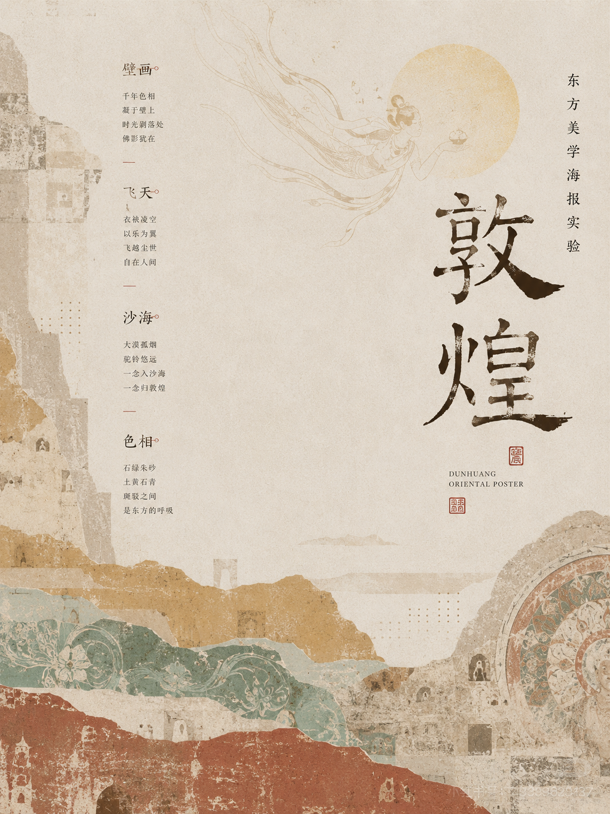</td>
    <td>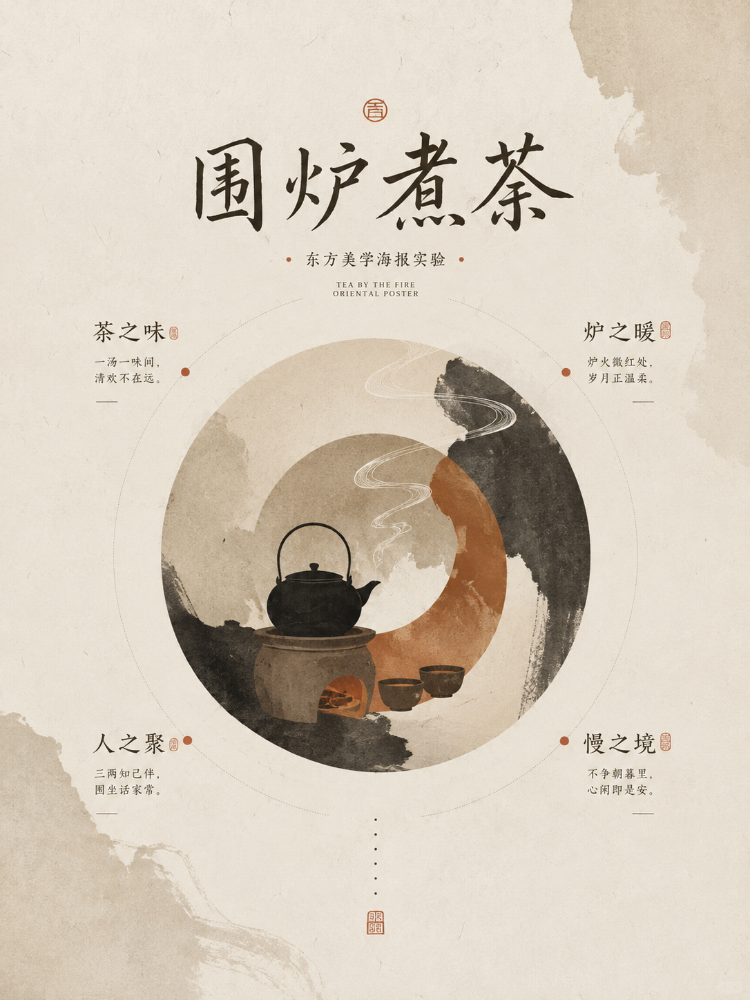</td>
    <td>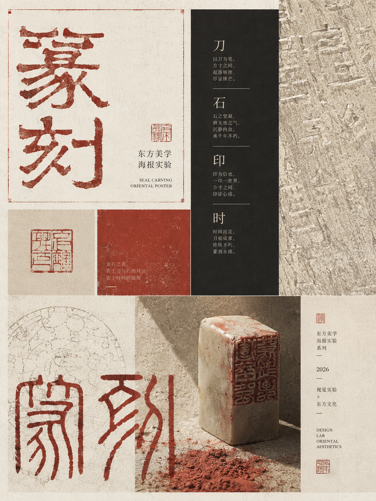</td>
  </tr>
  <tr>
    <td>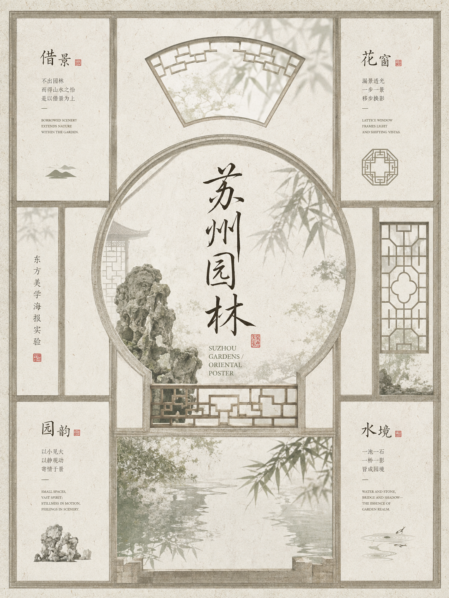</td>
    <td>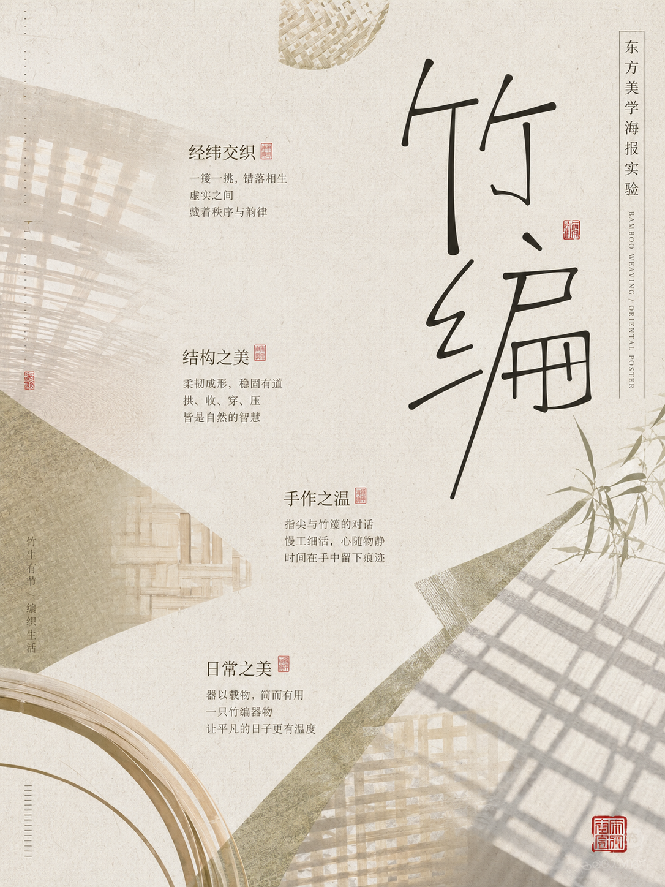</td>
    <td>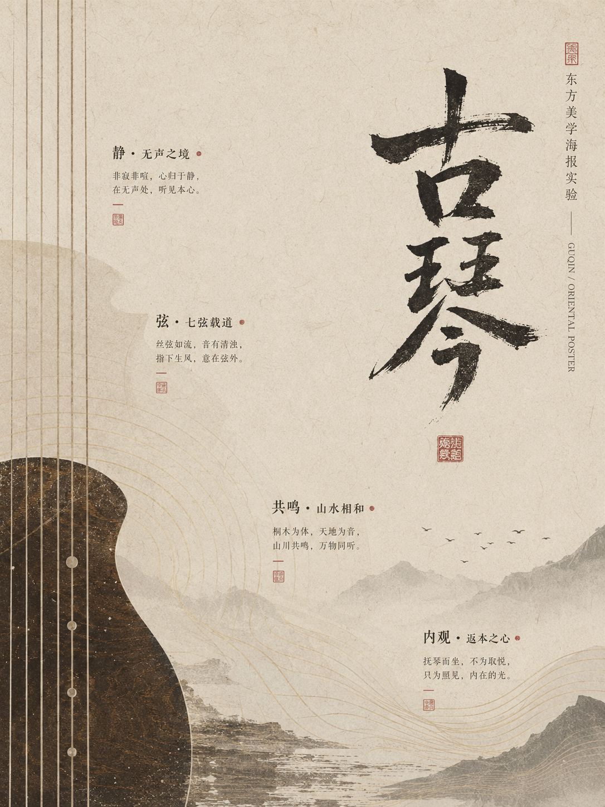</td>
  </tr>
</table>

### 现代东方材质与构图

<table>
  <tr>
    <td>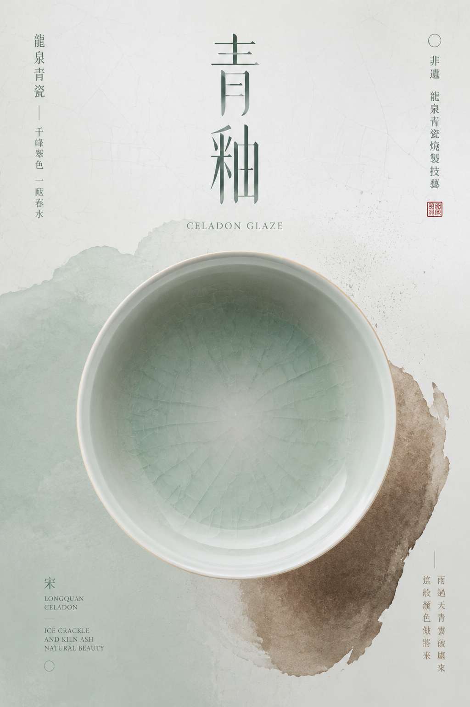</td>
    <td>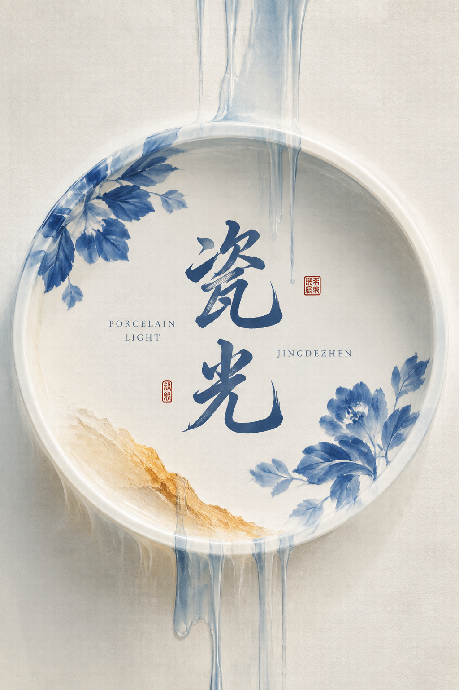</td>
    <td>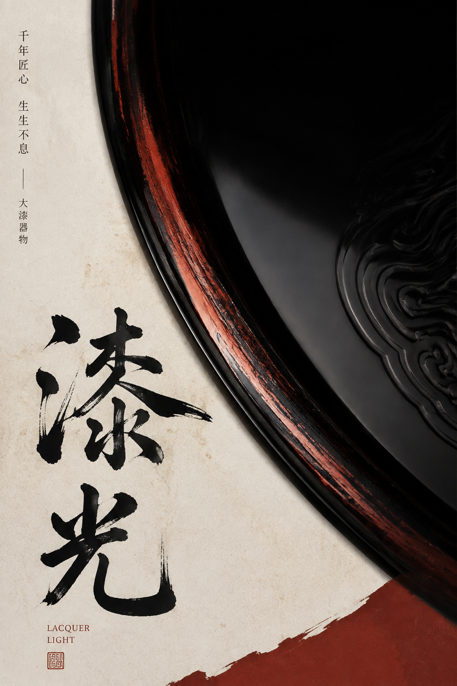</td>
  </tr>
  <tr>
    <td></td>
    <td>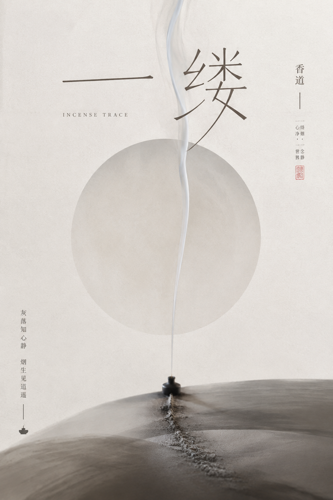</td>
    <td>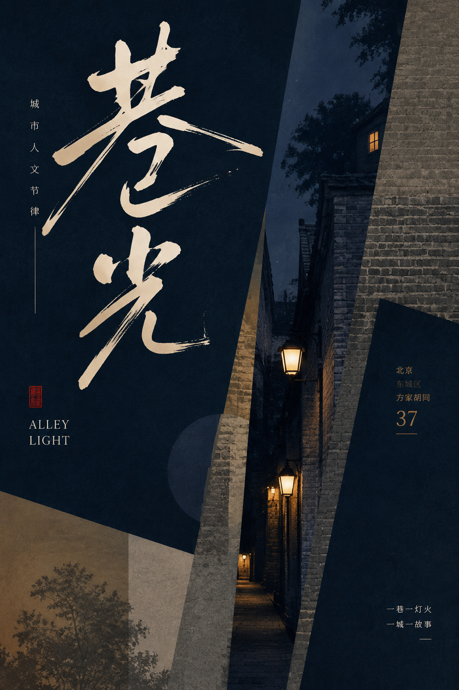</td>
  </tr>
</table>

### 标题实验

<p>
  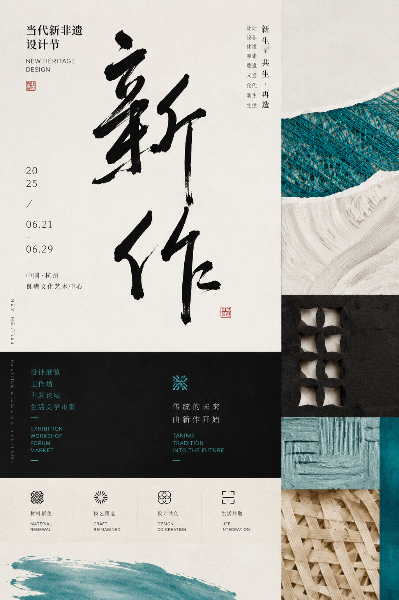
</p>

## 方法拆解

下面两张图展示了从参考素材到视觉方向、标题、材质和构图系统的整理方式：

<p>
  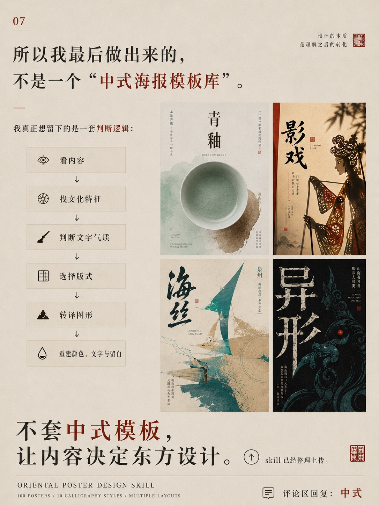
  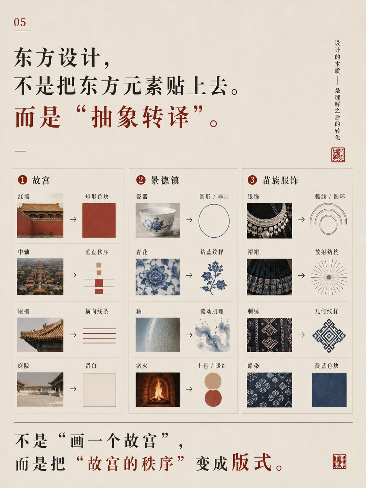
</p>

## 仓库结构

```text
chinese-style-poster-skill/
  SKILL.md                       # 完整 Skill 指令
  agents/openai.yaml             # Skill 元数据

examples/                        # README 精选样例
docs/                            # 方法拆解图

prepare_chinese_style_image2_jobs*.py
                                 # 生成批处理 JSONL 任务
batch_generate_chinese_style_posters.py
                                 # 调用图像生成后端
retry_chinese_style_round3.py   # 可恢复的批量重试
make_chinese_style_contact_sheet*.py
                                 # 生成联系表
chinese_style_poster_image2_*.jsonl
chinese_style_poster_image2_*.json
                                 # 任务和 manifest 示例
```

## 批量生成

先准备 JSONL 任务：

```powershell
python prepare_chinese_style_image2_jobs_round3.py
```

然后使用批处理或可恢复 runner：

```powershell
python batch_generate_chinese_style_posters.py
python retry_chinese_style_round3.py
```

使用宿主自带的图像能力时，不需要额外配置 API key。只有在主动运行可选 Python 批处理脚本并连接外部后端时，才需要按该后端的规则配置凭据，并可通过 `MALIANG_IMAGE_SCRIPT` 指定脚本路径。不要把 key、个人路径或内部服务地址写入仓库、prompt、JSONL 或 README。

## 完整规则

详细的视觉约束、标题预设、布局预设、颜色系统、文案层级和反漂移规则，见：

- [`chinese-style-poster-skill/SKILL.md`](chinese-style-poster-skill/SKILL.md)
- [`chinese_style_poster_image2_manifest_round3.json`](chinese_style_poster_image2_manifest_round3.json)

## 说明

README 中的图像是用于展示视觉方向的精选素材。它们不要求复刻某一张图的具体人物、地点、构图或文字；Skill 的目标是学习视觉语言，并根据新的主题生成新的方向。
